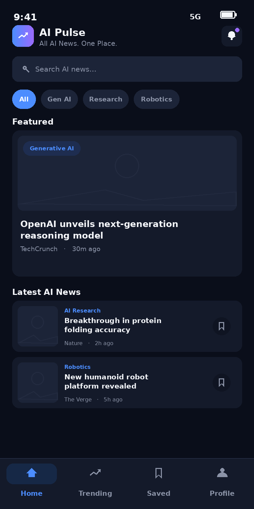
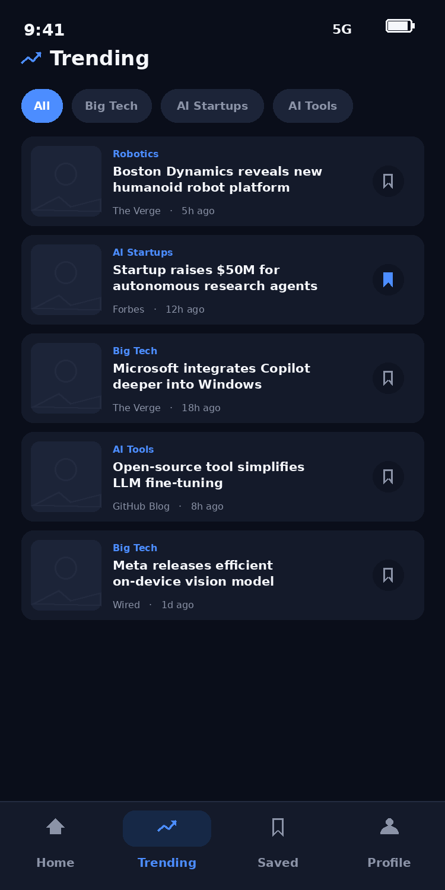
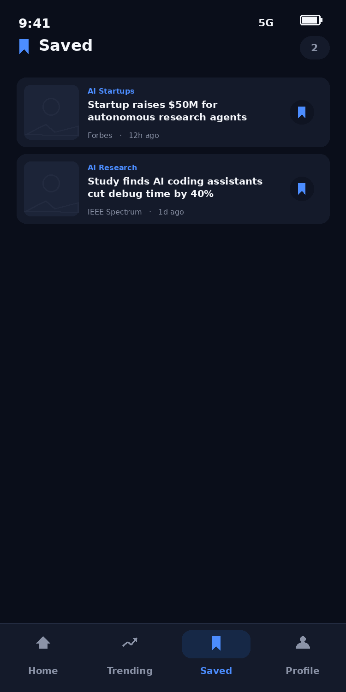
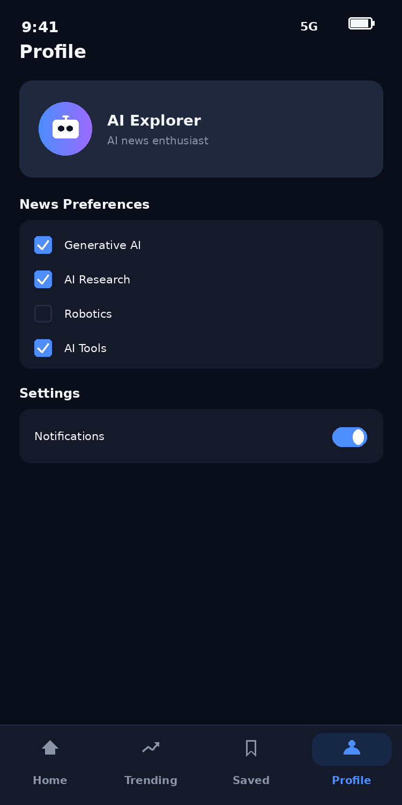
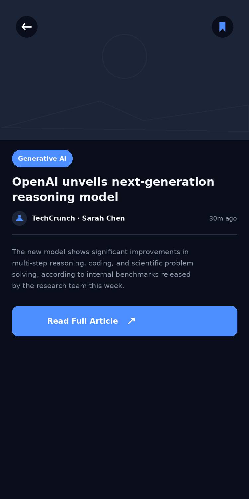

<div align="center">

# 📡 AI Pulse

### All AI News. One Place.

A minimal, modern, dark-themed Flutter app that aggregates the latest AI news
into a single, clean feed — built as a Flutter laboratory project.


</div>

---

## 📖 Overview

**AI Pulse** brings AI-related news — Generative AI, AI Research, Robotics,
AI Tools, AI Startups, and Big Tech — into one place, so you don't have to
follow a dozen different blogs and feeds to stay current.

The app is intentionally scoped to **four main screens** plus one secondary
details screen, keeping the codebase small enough to fully understand while
still looking and feeling like a real, polished product.

## ✨ Features

| Feature | Description |
|---|---|
| 🏠 **Home feed** | Featured story, category filter chips, live search, and a latest-news list |
| 📈 **Trending** | The same catalog re-sorted by recency, filterable by category |
| 🔖 **Bookmarking** | Save any article in-memory; reflected instantly across every screen |
| 💾 **Saved** | Dedicated list of bookmarked articles, with a friendly empty state |
| 👤 **Profile & settings** | Editable name (with form validation), category preferences, notification & theme toggles |
| 📰 **Article details** | Full story view opened via `Navigator.push()`, with hero image and a bookmark toggle |
| 🌐 **REST API** | Live `http.get()` integration with graceful mock-data fallback if the API/key is unavailable |
| 🔄 **Resilience** | Loading, error, and retry states plus pull-to-refresh everywhere |
| 🎬 **Animation** | Fade-in cards and a bookmark "pop" animation, kept subtle and purposeful |

## 📱 Output Screens

<div align="center">

| Home | Trending | Saved |
|:---:|:---:|:---:|
|  |  |  |

| Profile | News Details |
|:---:|:---:|
|  |  |

</div>

> **Note:** these screens are design mockups that match the app's implemented
> UI and color palette exactly. Swap them for real device screenshots
> (`flutter run` → capture) once you have a build running on your machine.

## 🛠️ Tech Stack

- **Flutter** — cross-platform UI toolkit, Material 3 widgets
- **Dart** — null-safe application logic
- **http** — the single external package, used for all REST calls
- **StatefulWidget + setState** — deliberately simple state management (no Provider / Bloc / Riverpod / GetX)

## 📂 Project Structure

```
lib/
├── main.dart                     Root app + RootShell (shared state)
├── models/
│   └── news_model.dart           NewsArticle data model
├── services/
│   └── news_api_service.dart     REST calls + mock-data fallback
├── screens/
│   ├── home_screen.dart
│   ├── trending_screen.dart
│   ├── saved_screen.dart
│   ├── profile_screen.dart
│   └── news_details_screen.dart  (secondary screen)
├── widgets/
│   ├── news_card.dart            Card with fade-in + bookmark pop animation
│   ├── category_chip.dart
│   └── bottom_nav.dart
└── theme/
    └── app_theme.dart            Centralized dark color palette + Material 3 theme
```

## 🚀 Getting Started

### Prerequisites
- [Flutter SDK](https://flutter.dev/docs/get-started/install) (stable channel)
- Android Studio / VS Code with the Flutter & Dart plugins
- An Android emulator, physical device, or Chrome for web

### Run it

```bash
# 1. Create a fresh Flutter project
flutter create ai_pulse_new
cd ai_pulse_new

# 2. Copy this repo's pubspec.yaml, lib/, and
#    android/app/src/main/AndroidManifest.xml into it, overwriting the defaults

# 3. Install dependencies
flutter pub get

# 4. Run
flutter run              # emulator / physical device
flutter run -d chrome    # web
```

### API configuration (optional)

By default AI Pulse runs entirely on **curated mock data** — no setup needed.
To pull live news instead:

1. Get a free API key from [NewsAPI.org](https://newsapi.org).
2. Open `lib/services/news_api_service.dart`.
3. Set `_apiKey` to your key.

If the key is missing, the request fails, or the response is malformed, the
app automatically falls back to mock data — it never crashes.

## ✅ Course Outcomes Covered

| Outcome | Focus | Demonstrated by |
|---|---|---|
| **C506.1** | Dart & Flutter basics | `NewsArticle` model, constructors, `fromJson`/`toJson`, Stateful/Stateless widgets |
| **C506.2** | Responsive UI & Navigator | Bottom navigation, `Navigator.push()`/`pop()`, `Sliver`-based responsive layouts |
| **C506.3** | Forms, animation, validation | Profile edit `Form` with `validator`, fade-in cards, bookmark `AnimatedScale`, `SnackBar` |
| **C506.4** | REST API & debugging | `http.get()`, `async`/`await`, JSON parsing, loading/error states, retry, pull-to-refresh, `debugPrint()` |

## 🗺️ Roadmap

- [ ] Persist bookmarks locally (`shared_preferences` or a local database)
- [ ] Push notifications for breaking AI news
- [ ] Light theme variant
- [ ] Personalized feeds based on saved category preferences
- [ ] Pagination / infinite scroll

## 📄 License

This project was built for educational purposes as part of a Flutter
laboratory course. Feel free to use it as a reference or starting point.

---

<div align="center">

Built with 💙 and Flutter — **AI Pulse**

</div>
